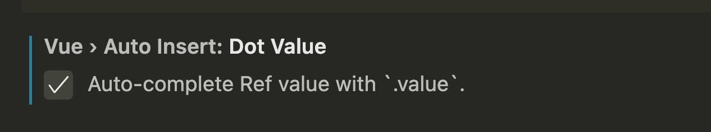

# Vue3 基础使用

## 在 vue2 和 vue3 写法上的区别

    1.vue2是options API，vue3是composition API
    2.vue3引入了setup函数，将data、methods等放在setup函数中
    3.这里可以插入一个对比图表，目前没找到

## setup

    1.setup的使用

```js
  setup() {
    // 定义非响应式数据
    let name = 'Vue3';
    let count = 0;
    // 定义非响应式方法
    const log1 = () => {
      console.log('1');
    };
    const updateCount = () => {
      // 由于定义的count是非响应式数据，所以这里需要手动更新视图
      count++;
    };
    // 返回数据
    return {
      name,
      count,
      log1,
      updateCount
    };
  }
```

    1.setup声明了属性，方法，返回的数据会被挂载到模板中，可以直接使用
    2.setup和data可以同时存在吗？
        可以，data可以读取setup中的数据，但setup不可以读取data中的数据，但是不能这么写，太恶心人；

## setup 简写

<script lang="ts" setup>
// 定义非响应式数据
let name = 'Vue3';
let count = 0;
// 定义非响应式方法
const log1 = () => {
  console.log('1');
};
const updateCount = () => {
  // 由于定义的count是非响应式数据，所以这里需要手动更新视图
  count++;
};
</script>

    1.使用script标签，lang="ts"表示使用typescript
    2.使用setup关键字，可以直接定义属性和方法，不需要再写setup函数


  使用vue-official插件的这个配置会在你输入的时候自动提示.value

## 数据响应

### 基本数据类型使用ref

```js
  // 定义响应式数据
  const count = ref(0);
  // 修改数据
  const updateCount = () => {
    count.value++;
  };
```

    1.使用ref包裹基本数据类型，使其变成响应式数据
    2.ref也可以包裹引用类型数据，但和reactive的区别是，ref包裹的引用类型数据，只有.value是响应式的
    3.修改数据时，需要通过.value来修改才会触发响应式

### 引用类型数据

```js
  // 定义响应式数据
  const obj = reactive({
    name: 'Vue3',
    count: 0
  });
  // 修改数据
  const updateCount = () => {
    obj.count++;
  };
```

    1.使用reactive包裹引用类型数据，使其变成响应式数据,并且遍历对象的属性也是响应式的
    2.修改数据时，直接修改obj中的属性即可，不用.value
    3.使用reactive不能赋值，否则会断开响应式；
    4.在对象的响应中，多使用reactive，省的写.value了；

我理解：本质上基本数据类型只能使用ref，因为基本数据类型无法使用proxy，把它包装成对象，再使用proxy，这样就可以实现响应式了；
而引用类型数据，本身就是对象，直接使用proxy就可以实现响应式了；

### 111
